# Rencie

Rencie (derived from "Currency") is a banking application simulation built with modern technologies, featuring multi-agent LLM capabilities for conversational transactions and real-time financial news integration.

## Repositories

| Component | Repository |
|-----------|------------|
| Main Application | https://github.com/werayco/rencie/tree/main |
| Apache Airflow | https://github.com/werayco/ApacheAirflow-PublicSubnet |
| MongoDB | https://github.com/werayco/MongoDB-Private-Subnet |

## Technology Stack

**Backend Framework**
- FastAPI
- Uvicorn
- Multithreading for concurrent operations in core banking logic

**Database**
- MongoDB with replica sets for transaction atomicity
- PyMongo

**AI and LLM**
- LangGraph
- LangChain
- Groq API (llama-3.3-70b-versatile)
- HuggingFace Embeddings
- FAISS for vector similarity search

**Task Management**
- Apache Airflow
- Celery
- Redis (message broker)

**Monitoring**
- Prometheus
- Grafana
- Slack integration

**Infrastructure**
- Docker
- Traefik (reverse proxy)
- AWS VPC
- GitHub Actions for CI/CD deployment
- Cloudflare for DNS management
- WhoGoHost as the domain registrar

**Authentication and Communication**
- JWT for authentication
- Resend for email delivery

## Architecture

### VPC Configuration

The project is deployed within an AWS VPC with the following configuration:

| Component | CIDR Block |
|-----------|------------|
| VPC | 18.0.0.0/16 |
| Public Subnet | 18.0.1.0/24 |
| Private Subnet | 18.0.2.0/24 |

### Component Placement

**Public Subnet (18.0.1.0/24)**
- Bastion Host
- Application Server (Rencie core logic)
- Apache Airflow instance

**Private Subnet (18.0.2.0/24)**
- MongoDB cluster (deployed via docker-compose)

This architecture ensures database isolation while maintaining accessibility for the application layer through the bastion host.

### Multi-Agent LLM System

The application features a conversational interface powered by LangGraph that enables users to perform banking transactions through natural language. The system uses Groq API with the llama-3.3-70b-versatile model.

**Agent Nodes**

| Node | Function |
|------|----------|
| Intent Agent | Classifies user intent and extracts structured data from natural language |
| Chat Agent | Handles general conversation and tool invocation for FAQ and news queries |
| Name Validator | Validates recipient account and displays transfer confirmation |
| OTP Generator | Generates and sends OTP to user email for transaction verification |
| OTP Input | Captures OTP input from user via interrupt |
| OTP Validator | Validates submitted OTP against stored value |
| Process Agent | Executes banking operations (transfer, balance check, statement) |

**Intent Classification**

The Intent Agent classifies user messages into four categories:

| Intent | Description |
|--------|-------------|
| transfer | User wants to send money to another account |
| check_balance | User wants to know their account balance |
| bank_statement | User wants a transaction statement |
| smalltalks | Greetings, casual chat, or unrelated messages |

**Routing Logic**

The system uses two routers to direct flow:

1. **First Router**: Routes banking intents (transfer, check_balance, bank_statement) to the secure OTP flow, and smalltalks to the chat agent
2. **Second Router**: After OTP validation, routes to process node if valid, or to retry flow if invalid (maximum 3 attempts)

**Graph Flow**

```
START → Intent Agent → [First Router]
                           ├── Secure Flow: Name Validator → OTP Generator → OTP Input → OTP Validator → [Second Router]
                           │                                                                                    ├── Valid: Process → END
                           │                                                                                    └── Invalid: OTP Failed → Retry or END
                           └── Chat Flow: Chat Agent ↔ Tools (vectordbMemory, search_finance_news)
```

**Tools**

| Tool | Purpose |
|------|---------|
| vectordbMemory | RAG memory system using FAISS for semantic similarity search against Rencie FAQ |
| search_finance_news | Searches financial news embeddings for market related queries |

**State Management**

The agent maintains state using MongoDBSaver checkpointer, tracking:
- Message history
- User intent
- Transaction details (amount, account numbers)
- OTP status and attempt count
- User information (name, email)

### Data Pipeline

Apache Airflow orchestrates a scheduled workflow that:

1. Scrapes financial news from Yahoo Finance RSS feeds
2. Converts scraped content into vector embeddings using HuggingFace
3. Stores embeddings in MongoDB


## Environment Variables

Create a `all.env` file in the project root with the following variables:

```
RESEND_API_KEY=resend_api_key
GF_USERNAME= grafana_username
GF_PASSWORD= grafana_password
secretKey= secret_key
JWT_SECRET= jwt_secret
GROQ_API_KEY= groq_api_key
MONGODB= mongodb_connection_string
```

### Obtaining API Keys

**GROQ_API_KEY**
1. Visit https://console.groq.com
2. Create an account or sign in
3. Navigate to API Keys section
4. Generate a new API key
5. Copy the key to your environment variables

**RESEND_API_KEY**
1. Visit https://resend.com
2. Create an account
3. Navigate to API Keys in the dashboard
4. Create a new API key

# Rencie Banking API Reference

| Endpoint | Method | Auth Required | Request Body | Response | Description |
|----------|--------|---------------|--------------|---------|-------------|
| `/` | GET | No | None | `{ "message": "health check route is active!" }` | Health check to verify server status |
| `/api/chat` | POST | JWT header | `{ "query": "message or OTP" }` | `{ "status": "success", "response": "chat response" }` | Handles chat interactions, OTP verification, and graph resumption |
| `/create-vector-store` | POST | No | Multipart file: `file_path` | `{ "message": "Vector store created successfully." }` | Upload file to create vector store for LLM queries |
| `/api/v1/create-account` | POST | No | `{ "firstName", "lastName", "dob", "password", "phoneNumber", "emailAddress", "ethAddress" }` | `{ "status": "Processing", "response": "Account creation queued." }` | Create a new user account asynchronously |
| `/api/v1/login` | POST | No | `{ "accountNumber", "password" }` | `{ "status": "successful", "token": "<JWT>" }` | Authenticate user and return JWT token |
| `/api/v1/check-balance` | POST | JWT token in body | `{ "token": "<JWT>" }` | `{ "status": "successful", "response": { "balance": 1000 } }` | Get account balance |
| `/api/v1/check-statement` | POST | JWT token in body | `{ "token": "<JWT>" }` | `{ "status": "Processing", "response": "Statement sent via email" }` | Asynchronously send bank statement to user email |
| `/api/v1/transfer` | POST | JWT token in body | `{ "token": "<JWT>", "receipientAccntNumber": "string", "amount": number }` | `{ "status": "successful", "response": "Transfer completed" }` | Transfer money to another account |

---

### Notes:
- **JWT Authentication:** Required for `/api/chat`, `/check-balance`, `/check-statement`, and `/transfer`.
- **Error Responses:** All endpoints return `{ "status": "failed", "response": "<error message>" }` on failure.
- **Async Tasks:** Account creation and statement retrieval are processed asynchronously.
- **OTP / Stop Command:** `/api/chat` supports detecting OTPs (5-digit numbers) and the "stop" command to halt interrupted graph sessions.


## Installation

### Prerequisites

- Docker and Docker Compose installed
- Git installed
- Access to required API keys


### Manual Setup

1. Clone the repository

```bash
git clone https://github.com/werayco/rencie.git
cd rencie
```

2. Create the Docker network

```bash
docker network create chatai
```

3. Create and configure your environment file

```bash
nano all.env
```

Edit the `all.env` file with your credentials.

4. Start the services

```bash
docker-compose up -d
```


## Monitoring

Access the monitoring dashboards:

- **Grafana**: http://localhost:3000 (use GF_USERNAME and GF_PASSWORD)
- **Prometheus**: http://localhost:9090

## How to integrate slack with grafana

### 1. Create a New Slack App
Go to [Slack API Apps](https://api.slack.com/apps) and click **Create New App**.

### 2. Start From Scratch
In the popup, select **From Scratch**.  

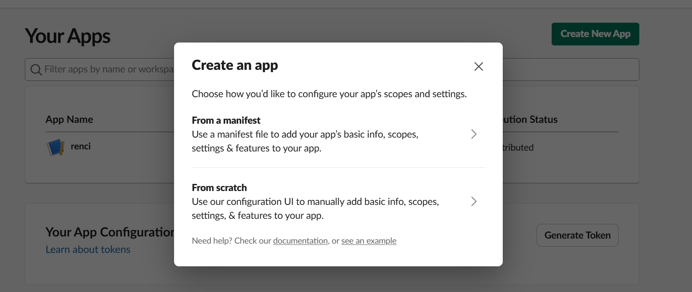

### 3. Name Your App and Select Workspace
Enter a name for your app and choose the workspace where it will be installed.  

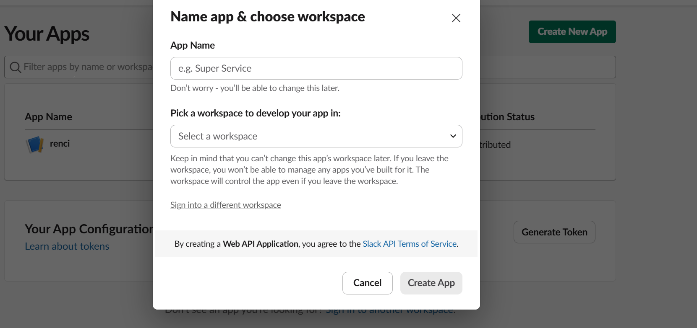

### 4. Enable Incoming Webhooks
In the app menu, click **Incoming Webhooks**.  

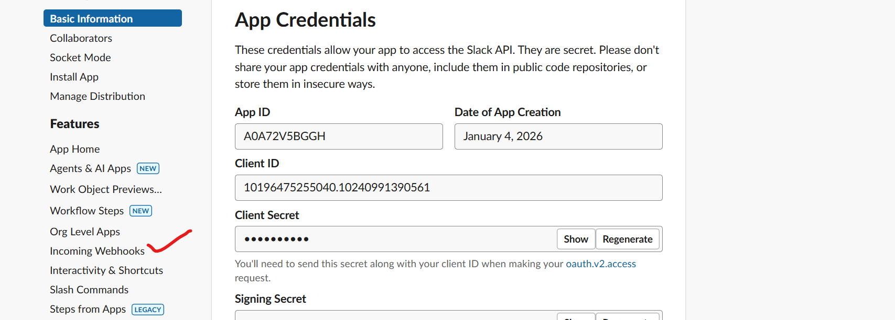
### 5. Activate Incoming Webhooks
Toggle the **Activate Incoming Webhooks** button to enable this feature.  

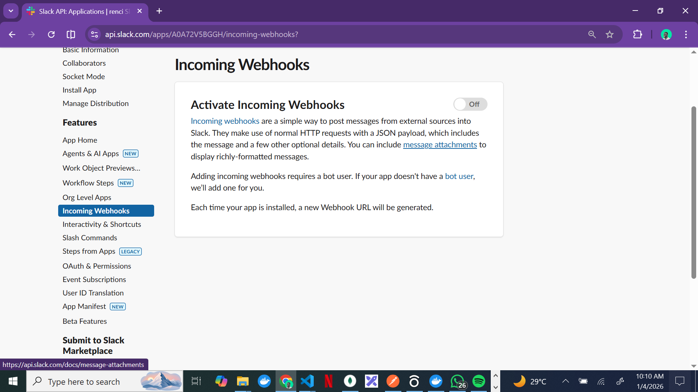

### 6. Add a New Webhook
Scroll to the bottom of the page and click **Add New Webhook to Workspace**.  

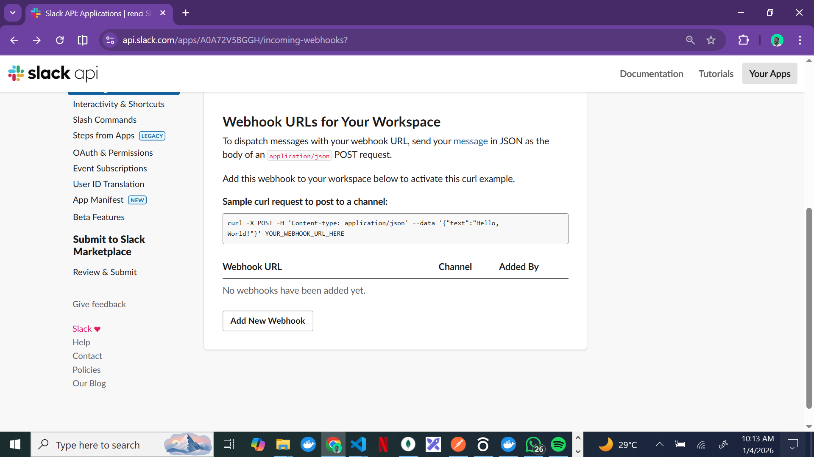

### 7. Grant Permissions
Fill in the required fields to grant your app access, then click **Allow**.  

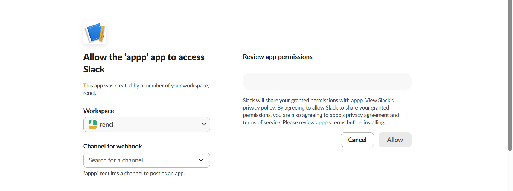

### 8. Copy Webhook URL
After authorization, you will be redirected back to the webhook page. Copy the **Webhook URL** — you will need it to configure Grafana.  

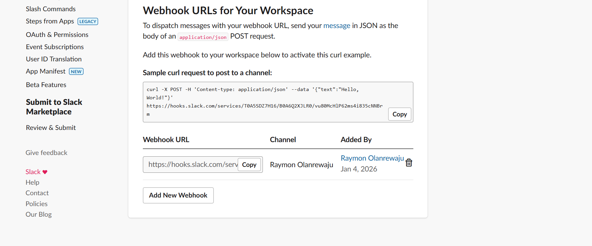

## 2. Integrating Slack with Grafana

### Step 1: Open Grafana
Visit [Grafana server](http://localhost:3000) and log in.

### Step 2: Navigate to Alerting
Go to **Alerting** → **Contact Points**.  

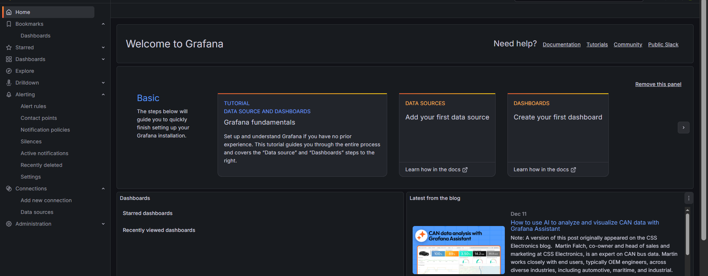

### Step 3: Create a Contact Point
Click **Create Contact Point**.  

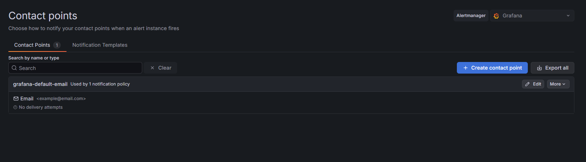

### Step 4: Configure Contact Point
Fill in the **Name** field (e.g., `Slack Integration`).  

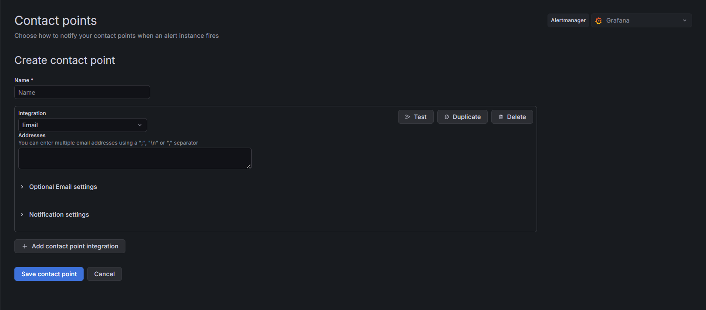

### Step 5: Add Webhook URL
Paste the copied Slack webhook URL into the **Webhook URL** field, then hit **Test** to check the integration.  

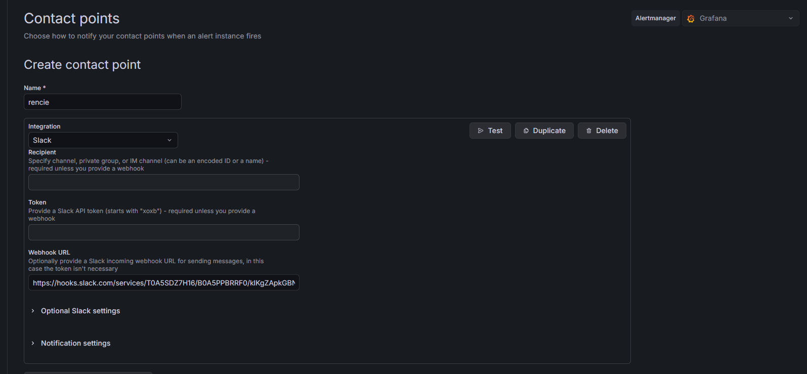

### Step 6: Send Test Notification
Click **Send test notification**.  
A message **“Test notification sent successfully”** will appear at the top of the popup.  

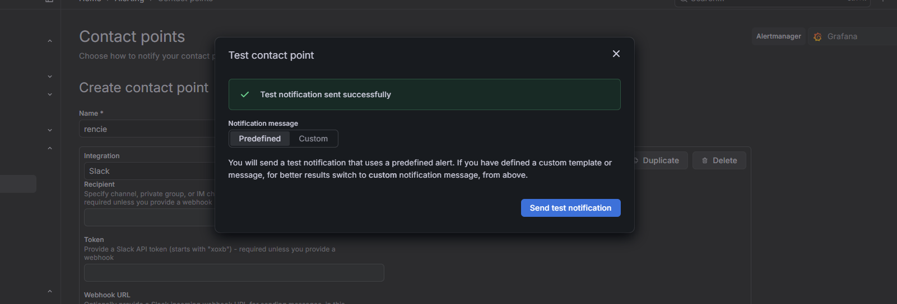